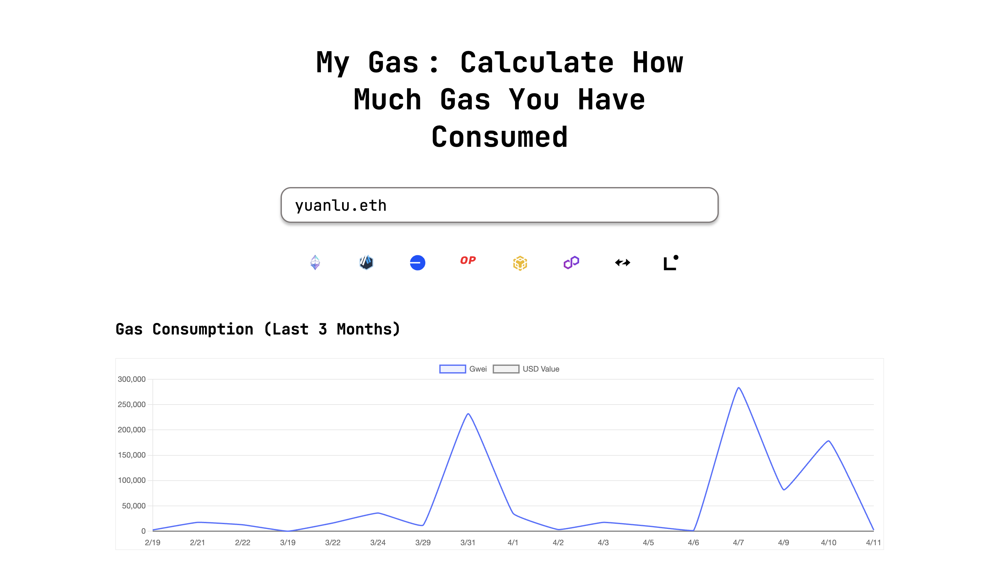

# My Gas : Calculate How Much Gas You Have Consumed

A web application to track historical gas consumption across multiple blockchains, providing insights into transaction costs in native tokens and USD.




## Features

- **Multi-Chain Support**: Track gas usage across Ethereum, Arbitrum, Base, Optimism, BSC, Polygon, zkSync, StarkNet, Linea, and Zircuit
- **Native Token Display**: Shows gas costs in the native token of each chain (Gwei for Ethereum-based chains)
- **USD Value Conversion**: Converts gas costs to USD based on current token prices
- **Transaction History**: Displays detailed transaction history with links to blockchain explorers
- **Data Visualization**: Charts showing daily gas consumption over the past 3 months
- **ENS Resolution**: Support for Ethereum Name Service domain lookups
- **Responsive Design**: Works on desktop and mobile devices

## Tech Stack

- **Backend**: Python, Flask
- **Frontend**: HTML, CSS, JavaScript, Chart.js
- **API**: Moralis Web3 API
- **Deployment**: Compatible with Heroku, Vercel, or any Python hosting service

## Getting Started

### Prerequisites

- Python 3.7+
- Moralis API Key (sign up at [moralis.io](https://moralis.io))

### Installation

1. Clone the repository:
   ```bash
   git clone https://github.com/yourusername/mygas.git
   cd mygas
   ```

2. Install dependencies:
   ```bash
   pip install -r requirements.txt
   ```

3. Create a `.env` file in the project root with your Moralis API key:
   ```
   MORALIS_API_KEY=your_moralis_api_key_here
   ```

### Running the Application

Start the application with:

```bash
python app.py
```

The application will be available at http://localhost:5000.

## Usage

1. Enter an Ethereum address or ENS domain (e.g., `yuanlu.eth`) in the search box
2. Click "Search" to retrieve and display gas usage data
3. View transaction history, gas consumption by chain, and daily gas charts
4. Click on transaction hashes to view details on the corresponding blockchain explorer

## Project Structure

```
mygas/
├── app.py              # Main application code with Flask routes and logic
├── index.html          # Frontend HTML, CSS, and JavaScript
├── .env                # Environment variables (not in repo)
├── requirements.txt    # Python dependencies
└── README.md           # Project documentation
```

## Performance Optimizations

- **API Caching**: Responses are cached to minimize API calls
- **Token Price Caching**: Token prices are refreshed hourly
- **Parallel Processing**: API calls are processed efficiently to improve load time

## Environment Variables

- `MORALIS_API_KEY` - Your Moralis API key for Web3 data access

## Deploying to Production

### Heroku Deployment

1. Create a Heroku app:
   ```bash
   heroku create mygas-app
   ```

2. Set environment variables:
   ```bash
   heroku config:set MORALIS_API_KEY=your_moralis_api_key_here
   ```

3. Deploy the app:
   ```bash
   git push heroku main
   ```

### Docker Deployment

1. Build the Docker image:
   ```bash
   docker build -t mygas .
   ```

2. Run the container:
   ```bash
   docker run -p 5000:5000 --env-file .env mygas
   ```

## Contributing

1. Fork the repository
2. Create a feature branch: `git checkout -b feature/my-feature`
3. Commit your changes: `git commit -am 'Add new feature'`
4. Push to the branch: `git push origin feature/my-feature`
5. Submit a pull request

## License

This project is licensed under the MIT License - see the LICENSE file for details.

## Acknowledgments

- Data provided by [Moralis](https://moralis.io)
- Icon designs based on blockchain official branding
- Chart visualization powered by [Chart.js](https://www.chartjs.org/)

## Test Examples

- ENS Domain: `yuanlu.eth`
- Ethereum Address: `0x73BE3b500f781234b21A348caFAaa23dfFf3b1B5`

## API Details

The application uses the Moralis API to retrieve blockchain data. The API endpoints are:

- `/api/gas?address=<address>` - Retrieve gas consumption data for a specific address

## Dependencies

- Flask: Web framework
- Requests: HTTP client for API calls
- Chart.js: Data visualization
- JetBrains Mono: Typography 